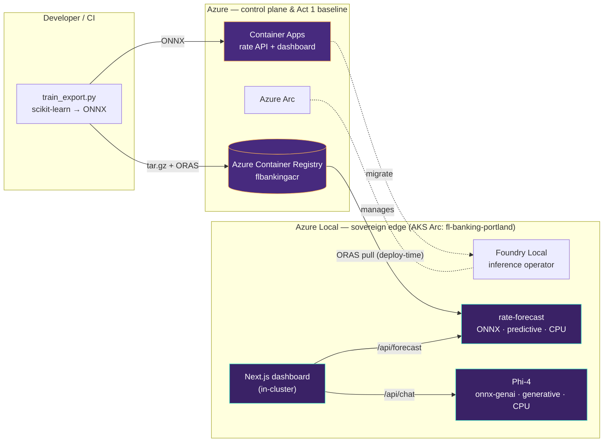

# FoundryLocal-Banking

> **Same model, same data, same UI — taken out of Azure and run whole at the edge.**

A workshop demo for a **regulated bank** that runs a rate-forecasting model in
Azure today and must move it on-premises for **data sovereignty** — keeping the
model, the data, *and* the user interface running locally with no cloud
dependency at runtime.

It runs on **Foundry Local on Azure Local** (the Arc-enabled Kubernetes flavour
of Foundry Local — not the consumer SDK). Once deployed, all inference happens
on-premises; no prompts or data leave the cluster.

```
 Azure (Act 1)                              Azure Local — AKS Arc (Acts 2-3)
 ┌────────────────────────┐                 ┌──────────────────────────────────┐
 │ Container Apps          │   ORAS → ACR    │ Foundry Local operator           │
 │  • ONNX rate model API  │ ───────────────▶│  • rate-forecast (predictive)    │
 │  • Next.js dashboard    │   (deploy-time  │  • Phi-4 (generative, catalog)   │
 │ location = cloud ~37ms  │    only)        │  • Next.js dashboard (in-cluster)│
 └────────────────────────┘                 │ location = edge ~42ms — identical│
                                             └──────────────────────────────────┘
```

---

## The demo in three acts

| Act | What happens | Where | Verified |
| --- | --- | --- | --- |
| **Act 1 — Model in Azure today** | ONNX rate model behind FastAPI + a Next.js dashboard. The "before" baseline. | Azure Container Apps (public cloud) | `location=cloud`, ~37 ms |
| **Act 2 — Migrate to the edge (HERO)** | The *same* `rate_forecast.onnx` packaged with ORAS → ACR, deployed to Foundry Local; UI redeployed in-cluster. | Azure Local — `fl-banking-portland` | `location=edge`, ~42 ms, **forecasts byte-identical to cloud** |
| **Act 3 — Add intelligence** | A catalog **Phi-4** generative model (onnx-genai, CPU) powers an "Ask the AI analyst" panel via `/api/chat`. | Azure Local — `fl-banking-portland` | Real LLM answer generated **at the edge** |

The point isn't raw inference speed — it's the **operational lifecycle**:
convert → package → push → deploy → manage → repoint, with the running state
fully sovereign.

---

## Architecture



Azure is used only as the **control plane** (Arc management, registry, identity)
plus the Act 1 baseline. After migration, the model **and** the UI are 100% on
Azure Local. ACR is the single cloud touchpoint at deploy time; once the
artifacts are cached, the running state is sovereign and air-gap capable.

---

## Where the models come from

- **Predictive rate model (the BYO hero) — we build it, not download it.**
  [`model/generate_data.py`](model/generate_data.py) creates synthetic,
  regulator-safe rate data (Vasicek short-rate + Nelson-Siegel curve, 2,520
  rows — no real customer data).
  [`model/train_export.py`](model/train_export.py) trains a compact scikit-learn
  `HistGradientBoostingRegressor` and exports it to **ONNX (opset 17) via
  skl2onnx** — a ~1.4 MB file, test MAE 9.62 bps. This stands in for the bank's
  existing in-Azure model.
- **Phi-4 (Act 3 generative) — pulled from the Foundry Local catalog**
  (`Phi-4-generic-cpu`, served with the `onnx-genai` runtime on CPU).
- [`model/convert_hf_to_onnx.sh`](model/convert_hf_to_onnx.sh) is an
  *illustrative* "Hugging Face → Olive → ONNX" example only; it is **not run**
  in the demo. Getting to ONNX is the customer's responsibility — the platform
  value is everything downstream of a validated ONNX model.

---

## Repository layout

| Path | Purpose |
| --- | --- |
| `infra/` | PowerShell: inventory, AKS Arc create, Foundry prereqs/extension, ACR, Entra, **Act 1 ACA deploy** (`20-deploy-aca.ps1`), **edge deploy** (`21-deploy-edge.ps1`) |
| `k8s/` | `ModelDeployment` manifests (BYO rate model + catalog Phi-4), dashboard Deployment/Service, secret templates |
| `model/` | Synthetic data, train/export to ONNX, ONNX validation + dynamic-axis fix, ORAS packaging |
| `app/` | Next.js dashboard — `/api/forecast` (predictive) and `/api/chat` (Phi-4); edge/cloud badge |
| `azure-api/` | FastAPI + onnxruntime inference service for Act 1 (cloud) |
| `scripts/` | Catalog listing + inference helpers |
| `docs/` | `SPEC.docx` (technical spec, as-built v0.2) and `Foundry_Local_Sovereign_Demo_Slides.pptx` (workshop deck) |
| `config/` | `environment.example.json` — copy to `environment.json` (gitignored) and fill in |

---

## Quick start

### 1. Local model pipeline (no Azure required)

```powershell
cd model
pip install -r requirements.txt
python generate_data.py
python train_export.py
python validate_onnx.py
```

### 2. Run the dashboard locally

```powershell
cd app
npm install
npm run dev   # http://localhost:3000
```

### 3. Act 1 — deploy the cloud baseline

```powershell
# Fill in config/environment.json first (infra/00-inventory.ps1 discovers IDs)
./infra/11-create-acr.ps1
./infra/20-deploy-aca.ps1   # builds + deploys the rate API + dashboard to Container Apps
```

### 4. Acts 2-3 — migrate to the sovereign edge

```powershell
# Package the BYO ONNX model and push to ACR as an OCI artifact
./model/package_and_push.sh ./model/artifacts flbankingacr models/rate-forecast v2

# Deploy on Foundry Local (BYO predictive + catalog Phi-4 + dashboard)
kubectl apply -f k8s/secrets/registry-credentials.example.yaml   # after filling in
kubectl apply -f k8s/modeldeployment-rate-forecast.yaml
kubectl apply -f k8s/modeldeployment-catalog-smoke.yaml
kubectl apply -f k8s/dashboard.yaml
```

### 5. Test the edge (no public URL — sovereign by design)

```powershell
$env:KUBECONFIG="$env:USERPROFILE\.kube\config-portland-proxy"
az connectedk8s proxy --resource-group sovereign-ai-daz --name fl-banking-portland --file $env:KUBECONFIG
# in a second terminal:
kubectl port-forward -n fl-banking svc/rate-dashboard 8080:80
# browse to http://localhost:8080  (badge shows: edge)
```

The edge dashboard is intentionally **not** exposed publicly; access is brokered
through the Azure Arc proxy.

---

## Bring-your-own model config (Foundry Local)

The BYO model uses the **inline custom-model** pattern
([Microsoft Learn](https://learn.microsoft.com/en-us/azure/azure-sovereign-clouds/private/foundry-local/how-to-deploy-custom-model)).
See [`k8s/modeldeployment-rate-forecast.yaml`](k8s/modeldeployment-rate-forecast.yaml):

```yaml
spec:
  workloadType: predictive      # predictive + cpu selects the ONNX predictive image
  compute: cpu
  runtime: onnx-genai
  model:
    custom:                     # pulls the OCI artifact you pushed with ORAS
      registry: flbankingacr.azurecr.io
      repository: models/rate-forecast
      tag: v2
      credentials:
        secretRef:              # K8s secret for the private ACR pull
          name: registry-credentials
  endpoint:
    enabled: false              # no LoadBalancer — in-cluster ClusterIP :5000 only
```

Verify:

```powershell
kubectl get modeldeployment -n foundry-local-operator
kubectl get pods,jobs -n foundry-local-operator    # ready when Running
```

---

## Engineering notes (gotchas worth knowing)

- **ONNX dynamic axes must be named.** An unnamed batch dimension fails the
  serving sidecar's `/readyz` validation and the pod never becomes Ready. Fixed
  by naming the batch axis (`model/fix_dynamic_axes.py`).
- **Operator auth contract:** the serving sidecar accepts `api-key:` or
  `Authorization: Bearer` — **not** `X-API-KEY`. The dashboard sends all three so
  one image works in cloud and edge.
- **Next.js standalone** binds to `$HOSTNAME` (the pod name) by default; set
  `HOSTNAME=0.0.0.0` so it binds all interfaces behind the Service.
- **Phi-4 on CPU** has a cold first inference (~40 s). Warm it up once before a
  live demo.

---

## CI/CD

| Workflow | Trigger | Does |
| --- | --- | --- |
| `ci.yml` | PR | Model pipeline smoke + app build (no Azure) |
| `model.yml` | push to `model/**` | Train → ONNX → validate → ORAS push to ACR |
| `app.yml` | push to `app/**` | `az acr build` the dashboard image |
| `infra.yml` | manual | Cluster ops via `az connectedk8s proxy` |

---

## Status

- ✅ Acts 1–3 built and **verified end-to-end** (cloud baseline, edge migration
  with identical forecasts, edge generative chat).
- The `Microsoft.Foundry` extension is **preview, by request**:
  <https://aka.ms/FoundryLocalAzure_PreviewRequest>.

> Operational guardrail for this environment: stay in resource group
> `sovereign-ai-daz`; only create/edit/delete `fl-banking-*` resources (plus ACR
> `flbankingacr`) — everything else is read-only.
