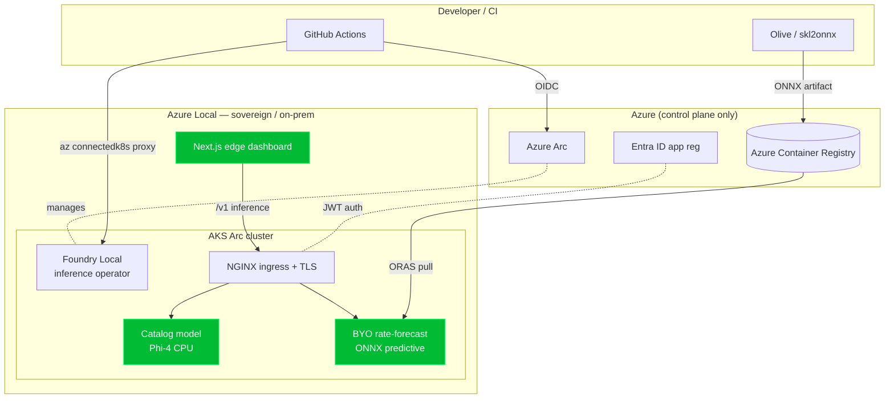

# FoundryLocal-Banking

Sovereign, edge-hosted **interest-rate forecasting** for banking, running on
**Foundry Local on Azure Local** (the Arc-enabled Kubernetes flavour of Foundry
Local — not the consumer SDK). All inference happens on-premises; no prompts or
data leave the cluster.

This repository demonstrates the full lifecycle:

1. **Provision** a new AKS cluster enabled by Azure Arc on Azure Local.
2. **Deploy** the Foundry Local inference operator as an Azure Arc extension.
3. **Catalog smoke test** — deploy a curated model (e.g. Phi-4) and call it.
4. **Bring-your-own model** — pull an off-the-shelf Hugging Face model, convert
   to **ONNX** with Olive (or train a compact predictive model), package it as an
   OCI artifact, push to ACR, and serve it at the edge.
5. **Visualize** — a Next.js dashboard renders the forecast yield curve and
   scenario analysis, calling only the edge endpoint.
6. **Automate** — GitHub Actions pipelines build the model, the app, and drive
   cluster operations through `az connectedk8s proxy`.

> Foundry Local on Azure Local is in **preview, by request**:
> https://aka.ms/FoundryLocalAzure_PreviewRequest — request access first; the
> `Microsoft.Foundry` extension install is gated on it.

## Architecture



Everything inside **Azure Local** stays on-prem. Azure is used only for the
control plane (Arc management, registry, identity) — inference never leaves the
edge.

## Repository layout

| Path | Purpose |
| --- | --- |
| `infra/` | PowerShell scripts: inventory, AKS Arc create, prereqs, Foundry extension, ACR, Entra |
| `k8s/` | `ModelDeployment` manifests (catalog smoke test + BYO rate model) and secret templates |
| `model/` | Synthetic data, train/export to ONNX, Olive HF→ONNX conversion, validation, ORAS packaging |
| `app/` | Next.js edge dashboard (yield-curve chart, scenario sliders, edge/mock badge) |
| `scripts/` | Catalog listing and inference helper scripts |
| `.github/` | CI gate, model/app build pipelines, infra workflow + Arc-proxy composite action |
| `config/` | `environment.example.json` — copy to `environment.json` and fill in |

## Quick start

### 1. Local model pipeline (no Azure required)

```powershell
cd model
pip install -r requirements.txt
python generate_data.py
python train_export.py
python validate_onnx.py
```

### 2. Run the dashboard locally (mock mode)

```powershell
cd app
npm install
npm run dev
# http://localhost:3000 — works without a cluster (mock forecast)
```

### 3. Provision and deploy to Azure Local

```powershell
# Fill in config/environment.json first (use infra/00-inventory.ps1 to discover IDs)
./infra/00-inventory.ps1 -ResourceGroup sovereign-ai-daz
./infra/01-create-aksarc.ps1
./infra/02-install-foundry-prereqs.ps1
./infra/10-create-entra-app.ps1
./infra/11-create-acr.ps1
./infra/03-deploy-foundry-local.ps1   # requires preview access
```

### 4. Deploy models

```powershell
# Catalog smoke test
./scripts/list-catalog.ps1
kubectl apply -f k8s/modeldeployment-catalog-smoke.yaml

# Bring-your-own banking model
./model/package_and_push.sh ./model/artifacts flbankingacr models/rate-forecast v1
kubectl apply -f k8s/secrets/registry-credentials.example.yaml   # after filling in
kubectl apply -f k8s/modeldeployment-rate-forecast.yaml
```

## The banking use case

Interest-rate modeling is fundamentally **predictive/numeric**, so the BYO model
is a compact multi-output regressor that forecasts the next-day yield curve from
a rolling window of recent curves. It exports to a sub-megabyte ONNX file served
as a Foundry Local `predictive` workload — fast, explainable, and ideal for a
regulated, sovereign, low-latency edge deployment. The Hugging Face → Olive path
is included for teams that prefer an off-the-shelf time-series model.

## CI/CD

| Workflow | Trigger | Does |
| --- | --- | --- |
| `ci.yml` | PR | Model pipeline smoke + app build (no Azure) |
| `model.yml` | push to `model/**` | Train → ONNX → validate → ORAS push to ACR |
| `app.yml` | push to `app/**` | `az acr build` the dashboard image |
| `infra.yml` | manual | Cluster ops via `az connectedk8s proxy` |

Required repo secrets: `AZURE_CLIENT_ID`, `AZURE_TENANT_ID`,
`AZURE_SUBSCRIPTION_ID`, `FOUNDRY_ENTRA_CLIENT_ID` (OIDC federated credentials).

## Status

Preview-gated components (the `Microsoft.Foundry` extension) require access via
the request form above. The model pipeline, dashboard (mock mode), and all
scaffolding run today without it.
